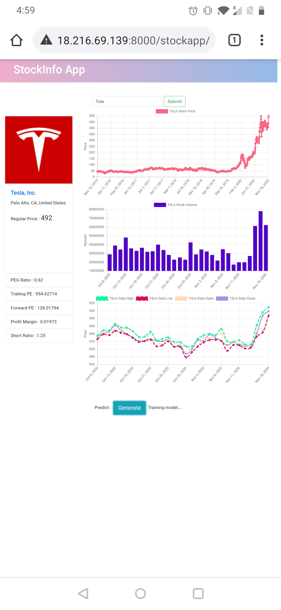
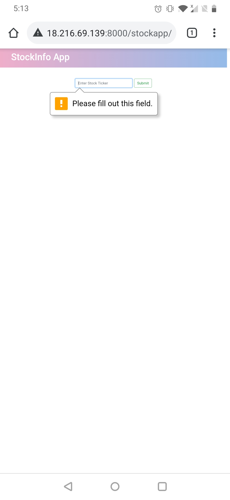
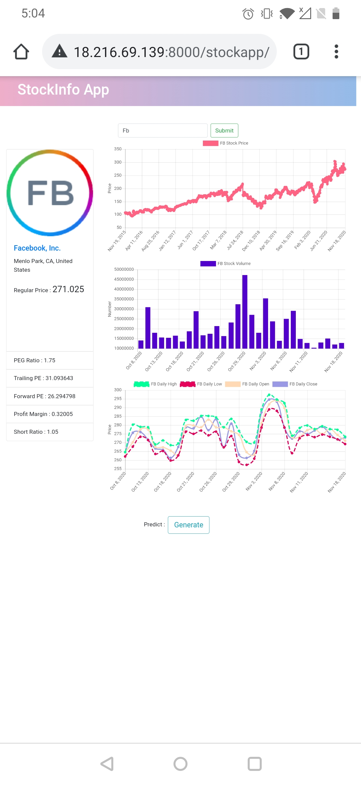
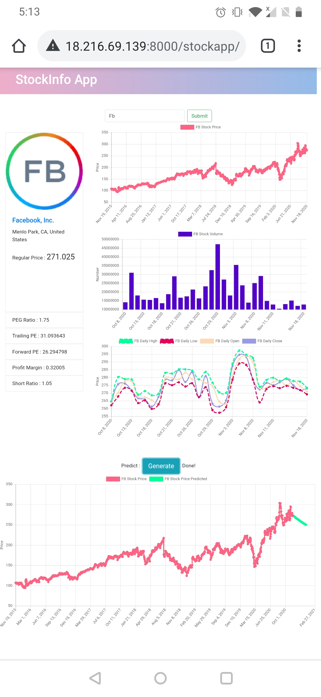

<!-- PROJECT SHIELDS -->
<!--
*** I'm using markdown "reference style" links for readability.
*** Reference links are enclosed in brackets [ ] instead of parentheses ( ).
*** See the bottom of this document for the declaration of the reference variables
*** for contributors-url, forks-url, etc. This is an optional, concise syntax you may use.
*** https://www.markdownguide.org/basic-syntax/#reference-style-links
-->
<!-- [![Contributors][contributors-shield]][contributors-url] -->
<!-- [![Forks][forks-shield]][forks-url] -->
<!-- [![Stargazers][stars-shield]][stars-url] -->
<!-- [![Issues][issues-shield]][issues-url] -->
[![MIT License][license-shield]][license-url]
[![LinkedIn][linkedin-shield]][linkedin-url]


<!-- TABLE OF CONTENTS -->
## Table of Contents

* [About the Project](#about-the-project)
  * [Built With](#built-with)
* [Getting Started](#getting-started)
  * [Prerequisites](#prerequisites)
  * [Installation](#installation)
* [Usage](#usage)
* [Roadmap](#roadmap)
* [Contributing](#contributing)
* [License](#license)
* [Contact](#contact)
* [Acknowledgements](#acknowledgements)


<!-- ABOUT THE PROJECT -->
## About The Project
<center>

</center>
<br>
A web app developed with an aim to help amateur investors by providing insights on a stock. Implemented a LSTM using Tensor Flow and Keras and trained it on stock price, volume and options information fetched using APIs. Generated market sentiment and probable price action. Used Django, React and Chart.js to pack the model and deploy it on cloud.


### Built With
*	[Python and Django](https://www.djangoproject.com/) – The programming language and framework
*	[Yfinance](https://pypi.org/project/yfinance/) - Yahoo! Finance market data downloader
*	[Numpy](https://numpy.org/)- Scientific computing in Python
*	[TensorFlow](https://www.tensorflow.org/) - Deep learning
*  [sklearn](https://scikit-learn.org/stable/) - Machine learning library
*	[Pandas](https://pandas.pydata.org/) - Data Analysis and manipulation tool
*	[Chart.js](https://www.chartjs.org/) - Javascript library for data visualization in frontend
*	[Bootstrap](https://getbootstrap.com) – CSS for frontend


## How to use
<div class="row">



</div>


<!-- GETTING STARTED -->
## Getting Started

You would need to clone the repo and have required packages installed.

### Prerequisites

Here is the list of packages and versions I have on my conda environment 
```sh
django=3.1.3
tensorflow=2.3.1
yfinance=0.1.54
numpy=1.18.5
mysqlclient=2.0.1
scikit-learn=0.23.2
```

### Additional notes:

Enter your django secret key and allowed host in webapps/settings.py
```
SECRET_KEY = 'YOUR KEY'

ALLOWED_HOSTS = ['YOUR IP HOST']
```


<!-- USAGE EXAMPLES -->
## Usage

```
git clone https://github.com/c-sachdeva/stock_webapp.git
cd Stock_Webapp
python3 manage.py makemigrations stockapp
python3 manage.py migrate
```
In webapps/settings.py
Add your IP address to ALLOWED_HOSTS list
Save the file and exit the editor

```
python3 manage.py runserver 0.0.0.0:8000
```

### Install and Configure MySQL

```
sudo apt install mysql-server
sudo apt install libmysqlclient-dev
sudo -H pip3 install mysqlclient
```

```
sudo mysql
create user ''@'localhost' identified by '';
grant all privileges on *.* to ''@'localhost';
quit;
```

```
mysql
create database django character set utf8;
quit;
```


<!-- ROADMAP -->
## Domain Map

See the [open issues]() for a list of proposed features (and known issues).

![domain]


<!-- CONTRIBUTING -->
## Contributing

Contributions are what make the open source community such an amazing place to be learn, inspire, and create. Any contributions you make are **greatly appreciated**.

1. Fork the Project
2. Create your Feature Branch (`git checkout -b AmazingFeature`)
3. Commit your Changes (`git commit -m 'Add some AmazingFeature'`)
4. Push to the Branch (`git push origin AmazingFeature`)
5. Open a Pull Request


<!-- LICENSE -->
## License

Distributed under the MIT License. See `LICENSE` for more information.


<!-- CONTACT -->
## Contact

Chirag Sachdeva - [webpage](https://csachdeva.com/) - csachdeva@cmu.edu

Project Link: [https://github.com/c-sachdeva/stock_webapp](https://github.com/c-sachdeva/stock_webapp)


<!-- MARKDOWN LINKS & IMAGES -->
<!-- https://www.markdownguide.org/basic-syntax/#reference-style-links -->
[contributors-shield]: https://img.shields.io/github/contributors/csachdeva/Stock_App.svg?style=flat-square
[contributors-url]: https://github.com/c-sachdeva/Stock_App/graphs/contributors
[forks-shield]: https://img.shields.io/github/forks/c-sachdeva/Stock_App.svg?style=flat-square
[forks-url]: https://github.com/c-sachdeva/Stock_App/network/members
[stars-shield]: https://img.shields.io/github/stars/othneildrew/Best-README-Template.svg?style=flat-square
[stars-url]: https://github.com/c-sachdeva/Stock_App/stargazers
[issues-shield]: https://img.shields.io/github/issues/othneildrew/Best-README-Template.svg?style=flat-square
[issues-url]: https://github.com/c-sachdeva/Stock_App/issues
[license-shield]: https://img.shields.io/github/license/othneildrew/Best-README-Template.svg?style=flat-square
[license-url]: https://github.com/c-sachdeva/stock_webapp/master/LICENSE.txt
[linkedin-shield]: https://img.shields.io/badge/-LinkedIn-black.svg?style=flat-square&logo=linkedin&colorB=555
[linkedin-url]: https://www.linkedin.com/in/csachdeva/
[tesla-screenshot]: imagesREADME/tesla.jpg
[fb1-screenshot]: imagesREADME/fb1.jpg
[fb2-screenshot]: imagesREADME/fb2.jpg
[fb3-screenshot]: imagesREADME/fb3.jpg
[domain]: imagesREADME/domain.png